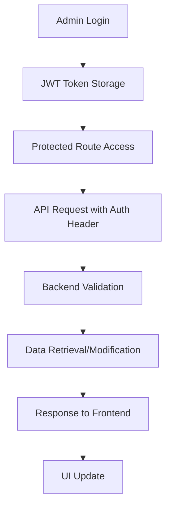

# Admin Panel Implementation Plan - Updated

## 1. Overview

This document outlines the comprehensive plan for implementing the new admin panel for the Artori application. The admin panel will be integrated into the main frontend application with dedicated admin routes, providing administrative functionalities for managing exams, users, analytics, and system settings.

**Key Changes from Original Plan:**

- Integration into main frontend app instead of separate deployment
- Enhanced UI/UX with modern glassmorphism design
- Comprehensive analytics and monitoring capabilities
- Advanced user management with detailed progress tracking
- System settings and configuration management
- Help and support system integration

## 2. Architecture Overview

### 2.1. Frontend Architecture

- **Framework:** React with TypeScript
- **Styling:** Tailwind CSS with glassmorphism design system
- **Routing:** React Router with protected admin routes
- **State Management:** React hooks and context
- **UI Components:** Custom component library with shadcn/ui base
- **Authentication:** JWT-based with role-based access control

### 2.2. Backend Integration

- **API:** FastAPI with MongoDB
- **Authentication:** JWT tokens with admin role validation
- **Database:** MongoDB with optimized collections for admin operations
- **Real-time Updates:** WebSocket support for live analytics (future enhancement)

## 3. Page Structure and Features

### 3.1. Admin Dashboard (`/admin`)

**Purpose:** Central hub with key metrics and system overview

**Features:**

- Real-time system metrics (users, exams, questions, system health)
- Recent activity feed with user registrations, exam completions, system events
- Exam performance overview with completion rates
- System performance monitoring (response time, error rate, uptime)
- Quick action buttons for common admin tasks

**Data Requirements:**

- User statistics (total, active, new registrations)
- Exam statistics (total exams, questions, completion rates)
- System health metrics
- Recent activity logs
- Performance analytics

### 3.2. Exam Management (`/admin/exams`)

**Purpose:** Comprehensive exam, subject, and question management

**Features:**

- **Exam Level:**

  - CRUD operations for exams
  - Exam metadata (name, country, description, flag, styling)
  - Status management (Active/Draft)
  - Bulk operations

- **Subject Level:**

  - CRUD operations for subjects within exams
  - Subject metadata (name, description, duration, question count)
  - Subject-specific styling and icons

- **Question Level:**
  - CRUD operations for questions within subjects
  - Question types (Multiple Choice, True/False, Short Answer)
  - Difficulty levels (Easy, Medium, Hard)
  - Rich text editor for question content
  - Answer options management
  - Detailed explanations with reasoning and sources

**Navigation:**

- Hierarchical breadcrumb navigation (Exams → Subjects → Questions)
- Drill-down interface with back navigation
- Search and filter capabilities at each level

### 3.3. User Management (`/admin/users`)

**Purpose:** Comprehensive user account and progress management

**Features:**

- **User Operations:**

  - CRUD operations for user accounts
  - Role management (Student, Teacher, Admin)
  - Account status management (Active/Inactive)
  - Bulk user operations

- **Progress Tracking:**

  - Individual user progress analytics
  - Subject-wise performance breakdown
  - Study time tracking and streaks
  - Accuracy rates and improvement trends
  - Exam completion statistics

- **User Profiles:**
  - Detailed user information display
  - Progress visualization with charts
  - Study history and patterns
  - Performance comparisons

### 3.4. Advanced Analytics (`/admin/analytics`)

**Purpose:** Detailed platform analytics and insights

**Features:**

- **User Analytics:**

  - User engagement metrics
  - Geographic distribution
  - Registration and retention trends
  - Session duration and frequency

- **Exam Performance:**

  - Exam popularity and completion rates
  - Subject-wise performance analysis
  - Question difficulty analysis
  - Success rate trends

- **System Analytics:**

  - Platform usage statistics
  - Performance metrics and bottlenecks
  - Error tracking and system health
  - Resource utilization

- **Export Capabilities:**
  - CSV/PDF report generation
  - Custom date range selection
  - Scheduled report delivery

### 3.5. System Settings (`/admin/settings`)

**Purpose:** Platform configuration and system management

**Features:**

- **General Settings:**

  - Application metadata (name, version, description)
  - Maintenance mode toggle
  - Feature flags and toggles

- **Database Configuration:**

  - Connection settings
  - Backup and maintenance schedules
  - Performance optimization settings

- **Email Configuration:**

  - SMTP settings
  - Email templates
  - Notification preferences

- **Security Settings:**

  - Authentication policies
  - Session management
  - Password requirements
  - Two-factor authentication

- **Localization:**

  - Language and timezone settings
  - Date and currency formats
  - Regional customizations

- **Theme Configuration:**
  - Color scheme customization
  - Branding elements
  - UI preferences

### 3.6. Admin Profile (`/admin/profile`)

**Purpose:** Admin account management and preferences

**Features:**

- **Personal Information:**

  - Profile details management
  - Avatar upload and management
  - Contact information

- **Security Management:**

  - Password change functionality
  - Two-factor authentication setup
  - Login alerts and security notifications

- **Notification Preferences:**
  - Email notification settings
  - Push notification preferences
  - Alert thresholds and triggers

### 3.7. Help & Support (`/admin/help`)

**Purpose:** Admin support and documentation

**Features:**

- **Knowledge Base:**

  - Searchable FAQ system
  - Step-by-step guides
  - Video tutorials
  - Best practices documentation

- **Support System:**

  - Ticket submission system
  - Live chat integration
  - Contact information
  - Community forum access

- **Resources:**
  - API documentation
  - System requirements
  - Security guidelines
  - Troubleshooting guides

## 4. Backend API Requirements

### 4.1. Authentication & Authorization

```
POST /api/v1/admin/auth/login
GET  /api/v1/admin/auth/me
POST /api/v1/admin/auth/refresh
POST /api/v1/admin/auth/logout
```

**Admin Role Validation:**

- JWT tokens must include admin role
- Role-based access control for different admin levels
- Session management and timeout handling

### 4.2. Dashboard Analytics

```
GET /api/v1/admin/dashboard/stats
GET /api/v1/admin/dashboard/activity
GET /api/v1/admin/dashboard/performance
GET /api/v1/admin/dashboard/exam-overview
```

### 4.3. Exam Management

```
# Exams
GET    /api/v1/admin/exams
POST   /api/v1/admin/exams
GET    /api/v1/admin/exams/{exam_id}
PUT    /api/v1/admin/exams/{exam_id}
DELETE /api/v1/admin/exams/{exam_id}

# Subjects
GET    /api/v1/admin/exams/{exam_id}/subjects
POST   /api/v1/admin/exams/{exam_id}/subjects
GET    /api/v1/admin/subjects/{subject_id}
PUT    /api/v1/admin/subjects/{subject_id}
DELETE /api/v1/admin/subjects/{subject_id}

# Questions
GET    /api/v1/admin/subjects/{subject_id}/questions
POST   /api/v1/admin/subjects/{subject_id}/questions
GET    /api/v1/admin/questions/{question_id}
PUT    /api/v1/admin/questions/{question_id}
DELETE /api/v1/admin/questions/{question_id}
```

### 4.4. User Management

```
GET    /api/v1/admin/users
POST   /api/v1/admin/users
GET    /api/v1/admin/users/{user_id}
PUT    /api/v1/admin/users/{user_id}
DELETE /api/v1/admin/users/{user_id}
GET    /api/v1/admin/users/{user_id}/progress
GET    /api/v1/admin/users/{user_id}/activity
POST   /api/v1/admin/users/{user_id}/reset-password
```

### 4.5. Analytics

```
GET /api/v1/admin/analytics/users
GET /api/v1/admin/analytics/exams
GET /api/v1/admin/analytics/performance
GET /api/v1/admin/analytics/geographic
GET /api/v1/admin/analytics/export
```

### 4.6. System Management

```
GET /api/v1/admin/system/health
GET /api/v1/admin/system/logs
GET /api/v1/admin/system/settings
PUT /api/v1/admin/system/settings
POST /api/v1/admin/system/backup
GET /api/v1/admin/system/maintenance
```

## 5. MongoDB Schema Extensions

### 5.1. Enhanced User Collection

```javascript
{
  _id: ObjectId,
  name: String,
  email: String,
  password: String,
  role: String, // "student", "teacher", "admin", "super_admin"
  status: String, // "active", "inactive", "suspended"
  selected_exam_id: ObjectId,
  profile: {
    avatar_url: String,
    phone: String,
    location: String,
    timezone: String,
    preferences: Object
  },
  created_at: Date,
  updated_at: Date,
  last_login: Date,
  login_count: Number
}
```

### 5.2. Enhanced Exam Collection

```javascript
{
  _id: ObjectId,
  name: String,
  country: String,
  description: String,
  status: String, // "active", "draft", "archived"
  subjects: [{
    _id: ObjectId,
    name: String,
    description: String,
    total_questions: Number,
    duration: String,
    icon: String,
    gradient: String,
    bgColor: String,
    status: String
  }],
  total_questions: Number,
  gradient: String,
  borderColor: String,
  bgColor: String,
  flag: String,
  metadata: {
    difficulty_level: String,
    target_audience: String,
    estimated_duration: String
  },
  created_at: Date,
  updated_at: Date,
  created_by: ObjectId
}
```

### 5.3. Enhanced Question Collection

```javascript
{
  _id: ObjectId,
  subject_id: ObjectId,
  question: String,
  question_type: String, // "multiple_choice", "true_false", "short_answer"
  difficulty: String, // "easy", "medium", "hard"
  options: [{
    id: String,
    text: String
  }],
  correct_answer: String,
  explanation: {
    reasoning: [String],
    concept: String,
    sources: [String],
    bias_check: String,
    reflection: String
  },
  tags: [String],
  status: String, // "active", "draft", "review"
  created_at: Date,
  updated_at: Date,
  created_by: ObjectId,
  reviewed_by: ObjectId,
  review_date: Date
}
```

### 5.4. Admin Activity Logs Collection

```javascript
{
  _id: ObjectId,
  admin_id: ObjectId,
  action: String, // "create", "update", "delete", "login", "logout"
  resource_type: String, // "exam", "user", "question", "system"
  resource_id: ObjectId,
  details: Object,
  ip_address: String,
  user_agent: String,
  timestamp: Date
}
```

### 5.5. System Settings Collection

```javascript
{
  _id: ObjectId,
  category: String, // "general", "email", "security", "theme"
  settings: Object,
  updated_by: ObjectId,
  updated_at: Date
}
```

### 5.6. Analytics Cache Collection

```javascript
{
  _id: ObjectId,
  metric_type: String,
  date_range: String,
  data: Object,
  generated_at: Date,
  expires_at: Date
}
```

## 6. Component Architecture

### 6.1. Shared Components

**AdminLayout**

- Consistent layout wrapper for all admin pages
- Sidebar navigation integration
- Header with breadcrumbs and user menu
- Responsive design with mobile support

**AdminSidebar**

- Navigation menu with active state management
- User profile dropdown with admin actions
- Collapsible design for mobile
- Role-based menu item visibility

**AdminDataTable**

- Reusable data table with sorting, filtering, and pagination
- Bulk action support
- Export functionality
- Responsive design with mobile-friendly views

### 6.2. Page-Specific Components

**Dashboard Components:**

- StatCard for metric display
- ActivityFeed for recent events
- PerformanceChart for system metrics
- ExamOverview for exam statistics

**Exam Management Components:**

- ExamForm for exam creation/editing
- SubjectForm for subject management
- QuestionEditor with rich text support
- BulkActions for batch operations

**User Management Components:**

- UserForm for user creation/editing
- ProgressChart for user analytics
- UserProfile for detailed user view
- BulkUserActions for batch operations

## 7. Authentication & Authorization

### 7.1. Role-Based Access Control

**Roles:**

- **Super Admin:** Full system access, user management, system settings
- **Admin:** Exam management, user viewing, analytics access
- **Teacher:** Read-only access to assigned students and exams

**Permission Matrix:**

```
Resource          | Super Admin | Admin | Teacher
------------------|-------------|-------|--------
Dashboard         | Full        | Full  | Limited
Exam Management   | Full        | Full  | Read
User Management   | Full        | View  | Assigned
Analytics         | Full        | Full  | Limited
System Settings   | Full        | None  | None
```

### 7.2. Security Implementation

**Frontend Security:**

- Route protection with role validation
- Component-level permission checks
- Secure token storage and management
- Automatic logout on token expiration

**Backend Security:**

- JWT token validation on all admin endpoints
- Role-based endpoint access control
- Request rate limiting
- Audit logging for all admin actions

## 8. Data Flow Architecture

### 8.1. Frontend Data Flow



### 8.2. Real-time Updates

**Implementation Strategy:**

- WebSocket connections for live dashboard updates
- Server-sent events for activity feeds
- Polling fallback for compatibility
- Optimistic UI updates for better UX

## 9. Migration Strategy

### 9.1. Phase 1: Backend API Development

1. Implement admin authentication endpoints
2. Create admin-specific API endpoints
3. Add role-based access control
4. Implement audit logging
5. Create database indexes for performance

### 9.2. Phase 2: Frontend Integration

1. Integrate admin routes into main frontend app
2. Implement authentication flow
3. Create shared admin components
4. Build dashboard with basic functionality
5. Add responsive design and mobile support

### 9.3. Phase 3: Feature Implementation

1. Complete exam management functionality
2. Implement user management with progress tracking
3. Build analytics dashboard with charts
4. Add system settings management
5. Implement help and support system

### 9.4. Phase 4: Advanced Features

1. Add real-time updates and notifications
2. Implement advanced analytics and reporting
3. Add bulk operations and data export
4. Implement advanced security features
5. Add system monitoring and alerting

## 10. Migration from Old Admin

### 10.1. Component Migration

**Reusable Elements:**

- Basic layout structure concepts
- Navigation patterns
- Color scheme and branding elements
- User authentication flow

**Components to Migrate:**

- Sidebar navigation structure → Enhanced AdminSidebar
- Basic dashboard cards → Enhanced StatCard components
- User profile display → Enhanced user management
- Activity feed concept → Real-time activity system

### 10.2. Data Migration

**No Data Migration Required:**

- Both systems use the same MongoDB database
- Existing user and exam data remains unchanged
- New admin features will work with existing data structure

### 10.3. Cleanup Strategy

**Phase 1: Parallel Operation** ✅ **COMPLETED**

- ✅ Kept old admin folder during development
- ✅ Used for reference and comparison
- ✅ Tested new admin against old admin functionality

**Phase 2: Feature Parity** ✅ **COMPLETED**

- ✅ Ensured all old admin features are implemented
- ✅ Conducted thorough testing of new admin
- ✅ Got stakeholder approval for migration

**Phase 3: Cleanup** ✅ **COMPLETED**

- ✅ **REMOVED** `/admin` folder and all its contents
- ✅ Updated documentation to reflect new admin structure
- ✅ Old admin code archived in version control

**Files Successfully Removed:**

```
admin/ [DELETED]
├── .gitignore
├── components.json
├── eslint.config.js
├── index.html
├── package-lock.json
├── package.json
├── postcss.config.js
├── README.md
├── tailwind.config.js
├── tsconfig.app.json
├── tsconfig.json
├── tsconfig.node.json
├── vite.config.ts
├── public/
└── src/
```

**Migration Status: COMPLETED** ✅

The old standalone admin application has been successfully removed. The new integrated admin panel is now the only admin interface, providing all administrative functionality through the main frontend application at `/admin` routes.

## 11. Performance Optimization

### 11.1. Frontend Optimization

- Code splitting for admin routes
- Lazy loading of admin components
- Optimized bundle size for admin features
- Caching strategies for admin data

### 11.2. Backend Optimization

- Database indexing for admin queries
- Query optimization for analytics
- Caching layer for frequently accessed data
- Rate limiting for admin endpoints

### 11.3. Monitoring and Analytics

- Performance monitoring for admin pages
- Error tracking and reporting
- User behavior analytics for admin interface
- System resource monitoring

## 12. Testing Strategy

### 12.1. Unit Testing

- Component testing for all admin components
- API endpoint testing for admin functionality
- Authentication and authorization testing
- Data validation and error handling testing

### 12.2. Integration Testing

- End-to-end admin workflow testing
- Cross-browser compatibility testing
- Mobile responsiveness testing
- Performance testing under load

### 12.3. Security Testing

- Authentication bypass testing
- Authorization validation testing
- Input validation and sanitization testing
- SQL injection and XSS prevention testing

## 13. Deployment Strategy

### 13.1. Development Environment

- Local development with hot reload
- Mock data for testing admin features
- Development database with test data
- Debug logging and error reporting

### 13.2. Staging Environment

- Production-like environment for testing
- Real data subset for comprehensive testing
- Performance monitoring and optimization
- Security testing and validation

### 13.3. Production Deployment

- Blue-green deployment strategy
- Database migration scripts
- Monitoring and alerting setup
- Rollback procedures and contingency plans

## 14. Future Enhancements

### 14.1. Advanced Analytics

- Machine learning insights for user behavior
- Predictive analytics for exam performance
- Advanced reporting with custom dashboards
- Integration with external analytics tools

### 14.2. Automation Features

- Automated user onboarding workflows
- Smart content recommendations
- Automated system maintenance tasks
- AI-powered question generation

### 14.3. Integration Capabilities

- Third-party authentication providers
- External learning management systems
- Payment processing integration
- API for third-party integrations

## 15. Success Metrics

### 15.1. Performance Metrics

- Page load times < 2 seconds
- API response times < 500ms
- 99.9% uptime for admin functionality
- Zero security vulnerabilities

### 15.2. User Experience Metrics

- Admin task completion rates > 95%
- User satisfaction scores > 4.5/5
- Support ticket reduction by 50%
- Training time reduction for new admins

### 15.3. Business Metrics

- Reduced administrative overhead
- Improved data accuracy and consistency
- Enhanced decision-making capabilities
- Increased operational efficiency

This comprehensive plan provides a roadmap for implementing a modern, scalable, and user-friendly admin panel that will significantly enhance the administrative capabilities of the Artori platform while maintaining security, performance, and usability standards.

## 16. Frequently Asked Questions (FAQ)

### How do I manage user permissions and roles?

The Artori platform uses a role-based access control system with three distinct user roles, each with specific capabilities and limitations:

#### Student Role Capabilities

- **Access:** Can access the main learning platform and practice exams
- **Exam Management:** Can view and take available exams and practice sessions
- **Progress Tracking:** Can view their own progress, scores, and study history
- **Profile Management:** Can update their own profile information and preferences
- **Limitations:** Cannot access admin panel, cannot view other users' data, cannot modify exam content

#### Admin Role Capabilities

- **Access:** Full access to admin panel with most administrative functions
- **Exam Management:** Can create, edit, and delete exams, subjects, and questions
- **User Management:** Can view all user accounts and their progress data
- **Analytics:** Can access comprehensive analytics and generate reports
- **Dashboard:** Can view system metrics, activity feeds, and performance data
- **Limitations:** Cannot access system settings, cannot manage other admin accounts, cannot perform super admin functions

#### Super Admin Role Capabilities

- **Access:** Complete system access with all administrative privileges
- **User Management:** Can create, edit, and delete all user accounts including other admins
- **System Settings:** Can modify system configuration, security settings, and platform preferences
- **Database Management:** Can access backup settings, maintenance schedules, and system health monitoring
- **Security Management:** Can configure authentication policies, session management, and security features
- **Full Control:** Can perform all admin functions plus system-level management and configuration

#### Role Assignment and Management

- User roles are assigned during account creation or can be modified by Super Admins
- Role changes take effect immediately upon update
- Each role has specific API endpoint access permissions enforced at the backend level
- Role-based UI elements ensure users only see features they have permission to use

For detailed permission matrices and specific feature access, refer to Section 7.1 (Role-Based Access Control) of this document.
