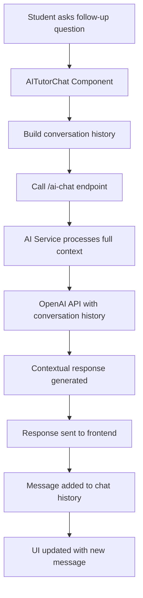

# Conversational AI Tutor Feature - Architectural Plan

## Problem Statement

The current AI Tutor implementation lacks conversational memory. When students ask follow-up questions like "Can you list some YouTube videos about this?", the system re-analyzes the original question instead of understanding the conversational context, resulting in generic responses.

## Current Architecture Issues

1. **Single-Turn Design**: The `/questions/{questionId}/ai-explanation` endpoint is designed for one-time explanations
2. **No Conversation Memory**: Each request is treated independently without context from previous messages
3. **Static Response Pattern**: The AI service always generates explanations for the original question regardless of user input

## Proposed Solution Architecture

### 1. Backend Changes

#### New API Endpoint

```
POST /api/v1/questions/{questionId}/ai-chat
```

**Request Body:**

```json
{
  "messages": [
    {
      "role": "system",
      "content": "Initial context with question and answer details"
    },
    {
      "role": "assistant",
      "content": "Hi! I'm your AI Tutor..."
    },
    {
      "role": "user",
      "content": "Can you list some YouTube videos about this?"
    }
  ]
}
```

**Response:**

```json
{
  "response": "Here are some YouTube videos about Irish literature themes...",
  "conversation_id": "uuid-for-tracking"
}
```

#### AI Service Enhancement

**New Function: `generate_chat_response()`**

- Accept full conversation history
- Maintain context awareness
- Generate contextually appropriate responses
- Handle various question types (explanations, resources, examples, etc.)

**Enhanced Prompt Engineering:**

```python
def build_chat_prompt(question_context, conversation_history):
    system_prompt = f"""
    You are an expert AI tutor helping a student understand: "{question_context['question']}"

    Student's answer: {question_context['selected_answer']}
    Correct answer: {question_context['correct_answer']}

    Guidelines:
    - Maintain conversation context
    - Provide helpful, educational responses
    - Suggest resources when asked
    - Explain concepts clearly
    - Be encouraging and supportive
    """

    return system_prompt + format_conversation_history(conversation_history)
```

### 2. Frontend Changes

#### AITutorChat Component Updates

**Enhanced Message Handling:**

```typescript
const handleSendMessage = async () => {
  // Build full conversation history
  const conversationHistory = [
    {
      role: "system",
      content: buildSystemContext(question, selectedAnswer, correctAnswer),
    },
    ...messages.map((msg) => ({
      role: msg.role,
      content: msg.content,
    })),
    {
      role: "user",
      content: inputMessage.trim(),
    },
  ];

  // Call new chat endpoint
  const response = await aiChatMutation.mutateAsync({
    questionId: question.id,
    messages: conversationHistory,
  });
};
```

#### New API Hook

```typescript
export const useAIChat = () => {
  return useMutation({
    mutationFn: async ({ questionId, messages }) => {
      return apiClient.sendAIChat(questionId, messages);
    },
  });
};
```

### 3. Data Flow Architecture



### 4. Implementation Strategy

#### Phase 1: Backend Foundation

1. Create new `/ai-chat` endpoint in `main.py`
2. Implement `generate_chat_response()` in `ai_service.py`
3. Add conversation history data models
4. Test with sample conversations

#### Phase 2: Frontend Integration

1. Update `AITutorChat` component to use new endpoint
2. Implement conversation history management
3. Add new API client methods
4. Create new React Query hook

#### Phase 3: Testing & Optimization

1. Test various conversation scenarios
2. Optimize token usage for long conversations
3. Add conversation persistence (optional)
4. Performance testing and monitoring

### 5. Technical Considerations

#### Token Management

- **Context Window**: Monitor OpenAI token limits (4K-8K tokens)
- **Conversation Pruning**: Implement smart truncation for long conversations
- **Cost Optimization**: Balance context retention with API costs

#### Error Handling

- **Fallback Mechanism**: Graceful degradation to single-turn responses
- **Rate Limiting**: Implement conversation-level rate limits
- **Validation**: Ensure conversation history integrity

#### Security & Privacy

- **Input Sanitization**: Validate all user messages
- **Context Isolation**: Ensure conversations don't leak between users
- **Data Retention**: Define conversation data lifecycle

### 6. Success Metrics

#### Functional Requirements

- [x] AI understands follow-up questions in context
- [x] Maintains conversation thread throughout session
- [x] Provides relevant resources when requested
- [x] Explains concepts based on previous discussion

#### Performance Requirements

- Response time: < 3 seconds for chat messages
- Token efficiency: < 2000 tokens per conversation turn
- Error rate: < 1% for valid conversation flows

#### User Experience Requirements

- Seamless transition from explanation to conversation
- Clear indication of AI understanding context
- Helpful and educational responses to various question types

### 7. Future Enhancements

#### Advanced Features

- **Conversation Persistence**: Save chat history across sessions
- **Multi-Modal Support**: Handle images, diagrams, equations
- **Personalization**: Adapt responses to student learning style
- **Integration**: Connect with external educational resources

#### Analytics & Insights

- **Conversation Analytics**: Track common question patterns
- **Learning Outcomes**: Measure educational effectiveness
- **Performance Monitoring**: API usage and response quality metrics

## Implementation Timeline

- **Week 1**: Backend endpoint and AI service updates
- **Week 2**: Frontend integration and testing
- **Week 3**: End-to-end testing and optimization
- **Week 4**: Performance tuning and deployment

## Risk Mitigation

1. **API Costs**: Implement token limits and conversation pruning
2. **Performance**: Add caching for common conversation patterns
3. **Quality**: Extensive testing with various conversation scenarios
4. **Fallback**: Maintain existing single-turn functionality as backup

This architectural plan provides a comprehensive roadmap for implementing true conversational AI tutoring capabilities while maintaining system performance and user experience quality.
